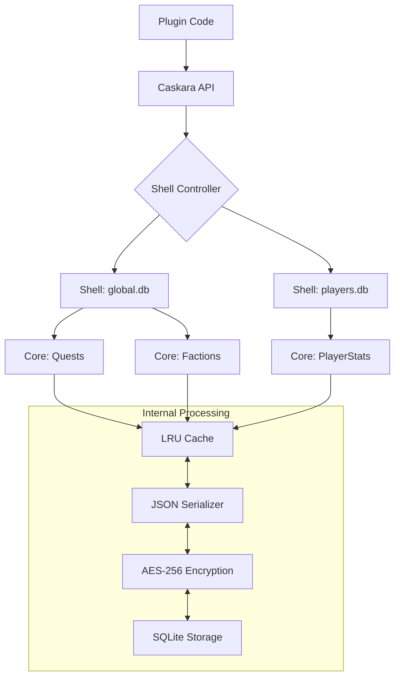

# Caskara: A Data Engine for Hytale Mods

Caskara is a data engine built specifically for the modding ecosystem of Hytale. It combines the reliability of SQLite with the flexibility of JSON-style data structures, giving mod developers a fast and practical way to store and manage persistent data.

Instead of relying on external services or complex setup, Caskara runs locally alongside the mod. This makes it easy to integrate while keeping performance stable even when a server is handling large amounts of game events or player data.

> [!WARNING]
> **BETA RELEASE**: Caskara is currently in Beta. While it has undergone extensive testing, it may still contain undiscovered bugs or inconsistencies. Please report any issues you find.

📖 **[Read the Full API Documentation](DOCS.md)**

📖 **[Read the Full Technical API](API.md)**

---

## � Architecture Overview

Caskara uses a unique **Shell & Core** architecture to manage data. Every database file is a "Shell", and every entity type within that shell is a "Core".



---

## 🏁 Beginner's Guide: Basic CRUD

Managing data with Caskara is intentionally simple. You don't need to write SQL or define schemas.

### 1. Model your data
Any Java class with a default constructor can be a Caskara entity. You can optionally use annotations to configure it dynamically:
```java
import com.cookie.caskara.annotations.*;

@CaskaraEntity(shell = "quests") // Store in quests.db instead of global.db
@Index("title")                  // Create an index for faster title lookups
@TTL(minutes = 60)               // Quests expire after 60 minutes by default
public class Quest {
    @Id
    public String questId;       // @Id marks the primary key
    
    public String title;
    public boolean completed;
}
```

### 2. Basic Operations
```java
// Save (Create or Update)
Quest q = new Quest("Fire Dragon", false);
Caskara.save(q);

// Load (Read)
Quest loaded = Caskara.load("Fire Dragon", Quest.class);

// List All
List<Quest> allQuests = Caskara.list(Quest.class);

// Delete (Discard)
Caskara.delete("Fire Dragon", Quest.class);
```

---

## 🛡️ Pro Patterns: The "Advanced Data Engine"

Caskara shines when you need professional-grade data integrity.

### ACID Transactions
Ensure multiple operations either all succeed or all fail. Perfect for economic transfers.
```java
Caskara.transaction(tx -> {
    Wallet p1 = tx.load("uuid1", Wallet.class);
    Wallet p2 = tx.load("uuid2", Wallet.class);
    
    p1.balance -= 100;
    p2.balance += 100;
    
    tx.save(p1);
    tx.save(p2); // If this throws an exception, p1's balance is ROLLED BACK automatically!
});
```

### Hooks & Validation
Automate logic before or after data is touched.
```java
var core = Caskara.core(Player.class);

// Stop bad data from being saved
core.addValidator(p -> p.level > 0);

// Log activity automatically
core.onAfterSave((id, p) -> Logger.info("Player " + p.name + " was saved."));
```

### Object Lifecycle: TTL & Soft Delete
```java
// This record will be physically deleted after 30 minutes by a background worker
Caskara.save(tempBuff, Duration.ofMinutes(30));

// Non-destructive delete. The data stays in DB but is ignored by Queries/Loads.
Caskara.softDelete("mod-123", ModData.class);
Caskara.restore("mod-123", ModData.class); // Bring it back!
```

---

## � Security: Transparent Encryption

Secure sensitive data (like Discord tokens or private keys) with AES-256. Caskara handles encryption and decryption automatically during I/O.

```java
// Call this once during initialization
Caskara.encrypt(SecretConfig.class, "your-super-secret-key");

// From now on, SecretConfig data is stored as encrypted blobs in SQLite
Caskara.save(new SecretConfig("token", "xyz-123"));

// Rotate encryption key seamlessly across all saved data without data loss
Caskara.rotateKey(SecretConfig.class, "your-super-secret-key", "new-stronger-key");
```

---

## � Technical Deep Dive

### How the JSON Query Engine works
Caskara uses SQLite's `json_extract` to query data without a fixed schema. When you call `createIndex()`, Caskara generates a **Computed SQL Index** on the JSON property.

```java
Caskara.createIndex(Player.class, "stats.level");

// Caskara runs this internally for O(1) lookups:
// CREATE INDEX idx_player_level ON elements(json_extract(json, '$.stats.level'))
```

### Performance Metrics
Caskara tracks everything. Access the `Stats` engine to see how your mod is performing:
```java
var stats = Caskara.stats();
System.out.println("Cache Hit Rate: " + stats.getCacheHitRate() * 100 + "%");
System.out.println("Avg Latency: " + stats.getAverageQueryTimeMs() + "ms");
```

---

## 📊 Technical Comparison

| Feature | Caskara | Raw SQLite | MongoDB |
| :--- | :---: | :---: | :---: |
| **NoSQL Flexibility** | ✅ (JSON) | ❌ (Rigid) | ✅ |
| **ACID Transactions** | ✅ Built-in | ✅ SQL | ✅ |
| **Transparent Encryption** | ✅ 1-Line | ❌ Complex | ✅ |
| **In-Memory Caching** | ✅ (LRU) | ❌ | ✅ |
| **Setup Overhead** | Zero | High | High |
| **Auto-Indexing** | ✅ | ❌ | ✅ |

---

## 🛑 When NOT to use Caskara

- **Massive BLOB storage**: Do not store large images or videos. Use Hytale's asset system instead.
- **Relational Complexity**: If your data requires 10+ table joins, use raw SQL.
- **Global Shared Databases**: For multi-server clusters, use a dedicated external DB.

## ⌨️ In-Game Command Suite

Caskara comes with a powerful in-game administrative command (`/caskara`) to manage your databases directly from Hytale:

*   `/caskara stats`: View total databases, cores, memory footprint, hit rates, and disk sizes.
*   `/caskara vacuum`: Manually trigger a global SQL VACUUM on all connected database shells.
*   `/caskara backup`: Instantly perform an atomic, thread-safe backup of all databases.
*   `/caskara autobackup <hours>`: Adjust or disable the Auto-Backup interval on the fly.
*   `/caskara dump <package_name>`: Export database contents to disk for analysis.
*   `/caskara scan <package_name>`: Manually scan packages for `@CaskaraEntity` definitions.

### Auto-Backup System
Caskara has a built-in background scheduler that safely backs up all active SQLite databases without causing locks or database corruption. It runs silently in the background every 1 hour by default.

> [!WARNING]  
> **Server Owners**: Although Caskara safely backs up your databases, you should **always** include the `global/` and `worlds/` folders in your own OS-level server backups! A broken hard drive or accidental folder deletion will destroy both your databases and Caskara's automatic `.bak` files. Do your own off-site backups!

---

## 📝 Changelog

### [2.0.0] - The Hardening Update

#### ✨ Features
*   **In-Game Command Suite**: Added the comprehensive `/caskara` command for database administration directly within Hytale.
*   **Native Atomic Auto-Backups**: Caskara now has a built-in background scheduler that safely backs up all active SQLite databases without causing locks or database corruption (properly handles SQLite WAL mode using native APIs). Enabled by default every 1 hour.
*   **Auto-Vacuum Scheduler**: Implemented a global background daemon to automatically VACUUM databases (every 12 hours by default) to keep storage footprint small.
*   **Annotation-Based Configuration**: Entities can now be fully configured via the `@CaskaraEntity` annotation.
*   **Package Scanning Utility**: Introduced automatic `@CaskaraEntity` registration via `Caskara.scanPackage()`.
*   **SQLite FTS5 Support**: Ultra-fast full-text search capabilities enabled via the `@FullTextSearch` annotation.
*   **Bulk Operations**: Implemented high-performance batch save (`saveAll()`) and delete operations using transactions.
*   **Query Expirations**: `expires_at` is now included in element queries and can be conditionally utilized.
*   **Java 25 Support**: Bumped the base compilation target in `gradle.properties` to Java 25.

---

_Made with ❤️ for the Hytale community._
