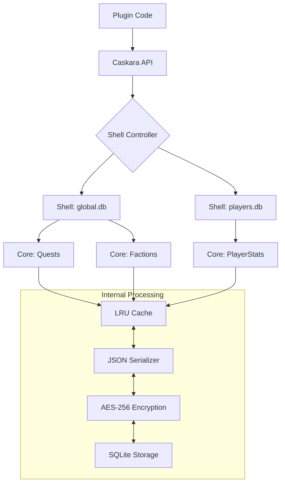

# Caskara: The Professional Data Engine for Hytale

Caskara is a high-performance, ACID-compliant NoSQL-style data engine built specifically for Hytale modding. It combines the extreme durability of **SQLite** with the flexibility of **JSON-based NoSQL**, providing a "plug-and-play" experience with professional features like transactions, encryption, and real-time observability.

---

## � Architecture Overview

Caskara uses a unique **Shell & Core** architecture to manage data. Every database file is a "Shell", and every entity type within that shell is a "Core".



---

## 🏁 Beginner's Guide: Basic CRUD

Managing data with Caskara is intentionally simple. You don't need to write SQL or define schemas.

### 1. Model your data
Any Java class with a default constructor can be a Caskara entity.
```java
public class Quest {
    public String id; // Automatically synced if named id, uuid, or uid
    public String title;
    public boolean completed;
}
```

### 2. Basic Operations
```java
// Save (Create or Update)
Quest q = new Quest("Fire Dragon", false);
Caskara.save(q);

// Load (Read)
Quest loaded = Caskara.load("Fire Dragon", Quest.class);

// List All
List<Quest> allQuests = Caskara.list(Quest.class);

// Delete (Discard)
Caskara.delete("Fire Dragon", Quest.class);
```

---

## 🛡️ Pro Patterns: The "Advanced Data Engine"

Caskara shines when you need professional-grade data integrity.

### ACID Transactions
Ensure multiple operations either all succeed or all fail. Perfect for economic transfers.
```java
Caskara.transaction(tx -> {
    Wallet p1 = tx.load("uuid1", Wallet.class);
    Wallet p2 = tx.load("uuid2", Wallet.class);
    
    p1.balance -= 100;
    p2.balance += 100;
    
    tx.save(p1);
    tx.save(p2); // If this throws an exception, p1's balance is ROLLED BACK automatically!
});
```

### Hooks & Validation
Automate logic before or after data is touched.
```java
var core = Caskara.core(Player.class);

// Stop bad data from being saved
core.addValidator(p -> p.level > 0);

// Log activity automatically
core.onAfterSave((id, p) -> Logger.info("Player " + p.name + " was saved."));
```

### Object Lifecycle: TTL & Soft Delete
```java
// This record will be physically deleted after 30 minutes by a background worker
Caskara.save(tempBuff, Duration.ofMinutes(30));

// Non-destructive delete. The data stays in DB but is ignored by Queries/Loads.
Caskara.softDelete("mod-123", ModData.class);
Caskara.restore("mod-123", ModData.class); // Bring it back!
```

---

## � Security: Transparent Encryption

Secure sensitive data (like Discord tokens or private keys) with AES-256. Caskara handles encryption and decryption automatically during I/O.

```java
// Call this once during initialization
Caskara.encrypt(SecretConfig.class, "your-super-secret-key");

// From now on, SecretConfig data is stored as encrypted blobs in SQLite
Caskara.save(new SecretConfig("token", "xyz-123"));
```

---

## � Technical Deep Dive

### How the JSON Query Engine works
Caskara uses SQLite's `json_extract` to query data without a fixed schema. When you call `createIndex()`, Caskara generates a **Computed SQL Index** on the JSON property.

```java
Caskara.createIndex(Player.class, "stats.level");

// Caskara runs this internally for O(1) lookups:
// CREATE INDEX idx_player_level ON elements(json_extract(json, '$.stats.level'))
```

### Performance Metrics
Caskara tracks everything. Access the `Stats` engine to see how your mod is performing:
```java
var stats = Caskara.stats();
System.out.println("Cache Hit Rate: " + stats.getCacheHitRate() * 100 + "%");
System.out.println("Avg Latency: " + stats.getAverageQueryTimeMs() + "ms");
```

---

## 📊 Technical Comparison

| Feature | Caskara | Raw SQLite | MongoDB |
| :--- | :---: | :---: | :---: |
| **NoSQL Flexibility** | ✅ (JSON) | ❌ (Rigid) | ✅ |
| **ACID Transactions** | ✅ Built-in | ✅ SQL | ✅ |
| **Transparent Encryption** | ✅ 1-Line | ❌ Complex | ✅ |
| **In-Memory Caching** | ✅ (LRU) | ❌ | ✅ |
| **Setup Overhead** | Zero | High | High |
| **Auto-Indexing** | ✅ | ❌ | ✅ |

---

## 🛑 When NOT to use Caskara

- **Massive BLOB storage**: Do not store large images or videos. Use Hytale's asset system instead.
- **Relational Complexity**: If your data requires 10+ table joins, use raw SQL.
- **Global Shared Databases**: For multi-server clusters, use a dedicated external DB.

---

### Developed for the next generation of Hytale Modding.
"Data management shouldn't be hard. It should be Caskara."
