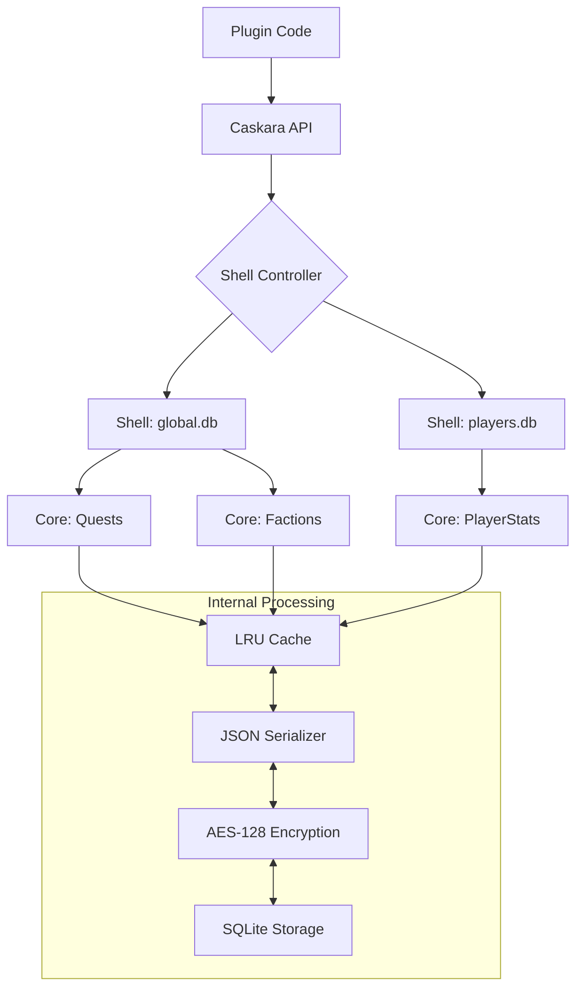

# Caskara: A Data Engine for Hytale Mods

Caskara is a data engine built specifically for the modding ecosystem of Hytale. It combines the reliability of SQLite with the flexibility of JSON-style data structures, giving mod developers a fast and practical way to store and manage persistent data.

Instead of relying on external services or complex setup, Caskara runs locally alongside the mod. This makes it easy to integrate while keeping performance stable even when a server is handling large amounts of game events or player data.

> [!WARNING]
> **BETA RELEASE**: Caskara is currently in Beta. While it has undergone extensive testing, it may still contain undiscovered bugs or inconsistencies. Please report any issues you find.

📖 **[Read the Full API Documentation](DOCS.md)**

📖 **[Read the Full Technical API](API.md)**

---

## � Architecture Overview

Caskara uses a unique **Shell & Core** architecture to manage data. Every database file is a "Shell", and every entity type within that shell is a "Core".


```mermaid
graph TD
    A[Plugin Code] --> B[Caskara API]
    B --> C{Shell Controller}
    C --> D[Shell: global.db]
    C --> E[Shell: players.db]
    D --> F[Core: Quests]
    D --> G[Core: Factions]
    E --> H[Core: PlayerStats]
    
    subgraph "Internal Processing"
    I[LRU Cache] <--> J[JSON Serializer]
    J <--> K[AES-128 Encryption]
    K <--> L[SQLite Storage]
    end
    
    F --> I
    G --> I
    H --> I
```

---

## 🏁 Beginner's Guide: Basic CRUD

Managing data with Caskara is intentionally simple. You don't need to write SQL or define schemas.

### 1. Model your data
Any Java class with a default constructor can be a Caskara entity. You can optionally use annotations to configure it dynamically:
```java
import com.cookie.caskara.annotations.*;

@CaskaraEntity(shell = "quests") // Store in quests.db instead of global.db
@Index("title")                  // Create an index for faster title lookups
@TTL(minutes = 60)               // Quests expire after 60 minutes by default
public class Quest {
    @Id
    public String questId;       // @Id marks the primary key
    
    public String title;
    public boolean completed;
}
```

### 2. Basic Operations
```java
// Save (Create or Update)
Quest q = new Quest("Fire Dragon", false);
Caskara.save(q);

// Load (Read)
Quest loaded = Caskara.load("Fire Dragon", Quest.class);

// List All
List<Quest> allQuests = Caskara.list(Quest.class);

// Delete (Discard)
Caskara.delete("Fire Dragon", Quest.class);
```

---

## 🛡️ Pro Patterns: The "Advanced Data Engine"

Caskara shines when you need professional-grade data integrity.

### ACID Transactions
Ensure multiple operations either all succeed or all fail. Perfect for economic transfers.
```java
Caskara.transaction(tx -> {
    Wallet p1 = tx.load("uuid1", Wallet.class);
    Wallet p2 = tx.load("uuid2", Wallet.class);
    
    p1.balance -= 100;
    p2.balance += 100;
    
    tx.save(p1);
    tx.save(p2); // If this throws an exception, p1's balance is ROLLED BACK automatically!
});
```

### Querying
A fluent builder that compiles down to SQL. Filters, pagination and terminal operations:
```java
List<Player> veterans = Caskara.query(Player.class)
        .fieldGreaterOrEqual("level", 50)
        .fieldNotEquals("banned", true)
        .orderBy("level", Query.Order.DESC)
        .page(1, 20)
        .fetch();

// Terminal operations that never materialise the objects
long total     = Caskara.query(Player.class).fieldGreaterOrEqual("level", 50).count();
boolean anyOp  = Caskara.query(Player.class).field("rank", "admin").exists();
int purged     = Caskara.query(Session.class).fieldLessThan("lastSeen", cutoff).delete();
```
`count()` ignores `limit`/`offset` on purpose, so it answers "how many pages?" rather than
"how many on this page?".

### Hooks & Validation
Automate logic before or after data is touched.
```java
var core = Caskara.core(Player.class);

// Stop bad data from being saved
core.addValidator(p -> p.level > 0);

// Log activity automatically
core.onAfterSave((id, p) -> Logger.info("Player " + p.name + " was saved."));
core.onAfterDelete(id -> Logger.info("Player " + id + " was removed."));
```

### Reactive Observers
React to changes as they happen. A `null` value means the record was deleted:
```java
var core = Caskara.core(Player.class);

core.observeAll((id, player) -> {
    if (player == null) cache.evict(id);
    else                cache.put(id, player);
});

// Watch a single record — and stop watching when it no longer matters
BiConsumer<String, Player> watcher = (id, p) -> hud.refresh(p);
core.observe(playerId, watcher);
core.unobserveAll(playerId); // on disconnect, or the listener map grows forever
```

### Object Lifecycle: TTL & Soft Delete
```java
// This record will be physically deleted after 30 minutes by a background worker
Caskara.save(tempBuff, Duration.ofMinutes(30));

// Non-destructive delete. The data stays in DB but is ignored by Queries/Loads.
Caskara.softDelete("mod-123", ModData.class);
Caskara.restore("mod-123", ModData.class); // Bring it back!
```

---

## � Security: Transparent Encryption

Secure sensitive data (like Discord tokens or private keys) with AES-128 (see the note below). Caskara handles encryption and decryption automatically during I/O.

```java
// Call this once during initialization
Caskara.encrypt(SecretConfig.class, "your-super-secret-key");

// From now on, SecretConfig data is stored as encrypted blobs in SQLite
Caskara.save(new SecretConfig("token", "xyz-123"));

// Rotate encryption key seamlessly across all saved data without data loss
Caskara.rotateKey(SecretConfig.class, "your-super-secret-key", "new-stronger-key");
```

---

## � Technical Deep Dive

### How the JSON Query Engine works
Caskara uses SQLite's `json_extract` to query data without a fixed schema. When you call `createIndex()`, Caskara generates a **Computed SQL Index** on the JSON property.

```java
Caskara.createIndex(Player.class, "stats.level");

// Caskara runs this internally for O(1) lookups:
// CREATE INDEX idx_player_level ON elements(json_extract(json, '$.stats.level'))
```

### Performance Metrics
Caskara tracks everything. Access the `Stats` engine to see how your mod is performing:
```java
var stats = Caskara.stats();          // default shell only
System.out.println("Cache Hit Rate: " + stats.getCacheHitRate() * 100 + "%");
System.out.println("Avg Latency: " + stats.getAverageQueryTimeMs() + "ms");

var global = Caskara.globalStats();   // aggregated across every open shell
System.out.println("Queries server-wide: " + global.getTotalQueries());
```

---

## 📊 Technical Comparison

| Feature | Caskara | Raw SQLite | MongoDB |
| :--- | :---: | :---: | :---: |
| **NoSQL Flexibility** | ✅ (JSON) | ❌ (Rigid) | ✅ |
| **ACID Transactions** | ✅ Built-in | ✅ SQL | ✅ |
| **Transparent Encryption** | ✅ 1-Line | ❌ Complex | ✅ |
| **In-Memory Caching** | ✅ (Dynamic LRU) | ❌ | ✅ |
| **Async Write Queue** | ✅ 100k+ TPS | ❌ Lock-heavy | ✅ |
| **Setup Overhead** | Zero | High | High |
| **Auto-Indexing** | ✅ | ❌ | ✅ |

---

## 🛑 Scale and Limitations: When to migrate?

Caskara is engineered to handle **colossal** amounts of data, provided your mod runs on a **Single Hytale Server**. Thanks to its Async Write-Ahead Queue, Caskara can easily absorb 50,000 to 100,000 asynchronous writes per second without blocking the main game thread. However, you must understand its architectural limits:

**Do NOT use Caskara if:**
- **You are building a Multi-Server Network (BungeeCord/Proxy Style)**: SQLite relies on physical file locks (`.db`). You cannot share a single Caskara database file across multiple physical servers running on different machines. Doing so over a network drive will cause data corruption. *Migration Path: If your mod grows to a multi-server network, you must migrate to a centralized database like MongoDB or MySQL.*
- **You require heavy Relational Joins**: Caskara is a Document Store (NoSQL). While it supports indexing, if your data model requires complex joins across 10+ tables (e.g., highly relational web-app structures), you should use a raw SQL approach.
- **You are storing BLOBs**: Do not store large images, videos, or schematics inside Caskara. Use Hytale's native asset system or standard flat-file storage for large binary files.

---

## 🔄 Legacy Data Auto-Migration & Safety Backups

### Why the Change?
Historically, older versions of Caskara used a single database named `default.db` by default. If multiple mods used Caskara on the same Hytale server without custom Shell configurations, they all read and wrote to the same file. This caused severe clashing and namespace conflicts. 

To fix this, version `2.1.0` introduces **Namespace Isolation** via `Caskara.init("my_mod_id", folder)`. However, if you simply rename the file, you would either break other mods or lose your users' existing data.

### How the Auto-Migration Works (Type Extraction)
Caskara resolves this cleanly and safely using **Type-Based Data Extraction**:
1. When you initialize your mod with its unique namespace (e.g. `my_mod_id.db`), Caskara detects if the legacy `default.db` still exists in the database directory.
2. **Safety Backup**: Before touching any data, Caskara automatically duplicates the original legacy database file to `default.db.migration.bak` in the same directory.
3. **Surgical Extraction**: Instead of moving the whole database (which would steal data belonging to other mods), Caskara opens `default.db`, extracts **only the rows matching the entity classes registered by your mod** (using the `type` column), and moves them into your new, isolated `my_mod_id.db` file.
4. **Cleanup**: Once copied successfully, it deletes those specific rows from the old `default.db` file. 

*Result:* Your mod gets its isolated database, other legacy mods can still read their own data from `default.db`, and you have a safety backup file (`default.db.migration.bak`) on disk in case you need to rollback.

> [!NOTE]
> **Who is affected?** This auto-migration ONLY runs for entities that were previously saved in the default global database (`default.db`). If your entities were configured to use custom databases via `@CaskaraEntity(shell = "my_custom_shell")`, they are already isolated and will not trigger or be affected by this migration.

---

## ⌨️ In-Game Command Suite

Caskara comes with a powerful in-game administrative command (`/caskara`) to manage your databases directly from Hytale:

*   `/caskara stats`: View total databases, cores, memory footprint, hit rates, and disk sizes.
*   `/caskara vacuum`: Manually trigger a global SQL VACUUM on all connected database shells.
*   `/caskara backup`: Instantly perform an atomic, thread-safe backup of all databases.
*   `/caskara autobackup <hours>`: Adjust or disable the Auto-Backup interval on the fly.
*   `/caskara dump <package_name>`: Export database contents to disk for analysis.
*   `/caskara scan <package_name>`: Manually scan packages for `@CaskaraEntity` definitions.

### Auto-Backup System
Caskara has a built-in background scheduler that safely backs up all active SQLite databases without causing locks or database corruption. It runs silently in the background every 1 hour by default.

> [!WARNING]  
> **Server Owners**: Although Caskara safely backs up your databases, you should **always** include the `global/` and `worlds/` folders in your own OS-level server backups! A broken hard drive or accidental folder deletion will destroy both your databases and Caskara's automatic `.bak` files. Do your own off-site backups!

---

## 📝 Changelog

### [Unreleased] - Audit & Hardening

A full audit of the codebase. Several of these were silent data-loss bugs, so read the
upgrade notes before touching a live server.

#### 🐛 Critical Fixes
*   **`save(obj, ttlMillis)` expired every record instantly**: the overload passed the duration where an *absolute* timestamp was expected, so records were stamped as expiring in 1970 and vanished on the next read — no error, no log. `save(obj, Duration)` was always correct; only the millisecond overload was broken.
*   **Composite primary key**: `id` was the sole PRIMARY KEY while `type` was an ordinary column. Since every write is an `INSERT OR REPLACE`, saving two different entity types under the same id (a player name or UUID, say) silently destroyed the first one. The key is now `(id, type)`.
*   **A bare `@TTL` deleted everything**: with both attributes defaulting to 0, `@TTL` alone meant "expires now". It is now ignored with a warning.
*   **Schema migrations leaked plaintext**: after running a migrator the result was written back without re-encrypting, so reading an outdated `@Encrypted` record rewrote it in the clear.
*   **Reading inside a transaction always failed**: `tx.load()` dispatched the read to another thread while the calling thread held the lock, deadlocking until the 5s timeout fired.
*   **Nested transactions committed early**, breaking the atomicity of the outer block.
*   **Stale FTS5 entries**: `INSERT OR REPLACE` does not fire `AFTER DELETE` triggers unless `recursive_triggers` is on, so the search index accumulated orphaned rows.
*   **`@Id` inherited from a base class was ignored**, so `save(obj)` generated a fresh UUID on every call — one duplicate record per save.
*   **SQL injection in `createIndex()`**: the field name was interpolated straight into DDL. It is now validated.

#### ✨ Features
*   **Query terminal operations**: `count()`, `exists()` and `delete()`, plus the `fieldNotEquals()`, `fieldGreaterOrEqual()` and `fieldLessOrEqual()` operators.
*   **Observer lifecycle**: `discard()` and `softDelete()` now notify observers (a `null` value means "removed") and there is an `onAfterDelete()` hook. Subscriptions can finally be cancelled with `unobserve()` / `unobserveAll()` — the listener map previously only grew.
*   **`Caskara.globalStats()`** aggregates metrics across every open shell.
*   **Backup rotation**: keeps the 48 most recent backups per shell instead of growing forever (24 files/shell/day at the default hourly cadence).
*   **Configurable read timeout** via `Pearl.setDefaultTimeout()` / `sync(timeout, unit)`, replacing the hard-coded 5s.
*   **Export/import round-trips cleanly**: TTL, soft-delete state and schema version are now preserved.

#### ⚠️ Upgrade Notes
*   **The database is migrated in place on first open.** A consistent snapshot is written to `<shell>.db.pre-composite-key.bak` beforehand; if it cannot be created the migration aborts without touching your data. The rebuild runs in a transaction and is tracked with `PRAGMA user_version`, so it happens exactly once. **Back up your world before upgrading anyway.**
*   Indexes created at runtime through `Caskara.createIndex()` live on the old table and are dropped by the rebuild. Those declared with `@Index` come back automatically; purely programmatic ones must be re-issued.
*   `CaskaraAdminLogic.deleteEntity()` takes the entity type as a third argument now, since one id can legitimately map to several types.
*   `@Id` always wins over the `id`/`uuid`/`uid` naming convention. Previously `getId()` and `syncId()` disagreed when the `@Id` field was null.
*   Encryption is **AES-128/ECB**, not AES-256 as previously documented. See the threat model in `DOCS.md`.
*   `./gradlew shadowJar` no longer deploys to a local Hytale install automatically — use `-Pdeploy`, or run `./gradlew deploy`.

---

### [2.1.0] - Enterprise Scale Update

#### ✨ Features
*   **Async Write-Ahead Queue**: All asynchronous write operations (`preserveAsync`, `discardAsync`) are now completely lock-free for the calling thread. They drop instantly into a background `LinkedBlockingQueue` where a dedicated Worker Thread processes them using SQLite Batch Transactions, yielding up to a 100x write throughput increase!
*   **Dynamic LRU Cache**: The hardcoded 500-item cache limit has been removed. You can now use `@Cache(maxSize = 2000)` on your entities or call `Core.setCacheSize(int)` dynamically to dedicate more RAM to active entities.
*   **Namespace Isolation**: To prevent multiple mods from clashing over `default.db`, you must now initialize Caskara with a namespace: `Caskara.init("my_mod_id", folder)`. The old `init(File)` is deprecated but remains backward-compatible to prevent data loss.

---

### [2.0.1] - Hotfix & Command Parsing Update

#### 🐛 Bug Fixes
*   **Command Registration Fix**: Fixed a critical issue where `/caskara` commands were not being registered with the Hytale server during plugin initialization, rendering them inaccessible in-game.
*   **Command Argument Parsing**: Refactored the monolithic command structure into native Hytale `SubCommand`s. This resolves the parsing error that incorrectly required positional arguments to use flags (e.g., `--target=0`) instead of typing them naturally (e.g., `/caskara autobackup 0`).
*   **Build System Conflict**: Resolved an implicit dependency conflict in `build.gradle` between the default `jar` task and `shadowJar` that could cause build failures during deployment.

#### 📖 Documentation
*   **Command Suite Guide**: Updated the documentation to accurately reflect the new in-game command suite architecture.

---

### [2.0.0] - The Hardening Update

#### ✨ Features
*   **In-Game Command Suite**: Added the comprehensive `/caskara` command for database administration directly within Hytale.
*   **Native Atomic Auto-Backups**: Caskara now has a built-in background scheduler that safely backs up all active SQLite databases without causing locks or database corruption (properly handles SQLite WAL mode using native APIs). Enabled by default every 1 hour.
*   **Auto-Vacuum Scheduler**: Implemented a global background daemon to automatically VACUUM databases (every 12 hours by default) to keep storage footprint small.
*   **Annotation-Based Configuration**: Entities can now be fully configured via the `@CaskaraEntity` annotation.
*   **Package Scanning Utility**: Introduced automatic `@CaskaraEntity` registration via `Caskara.scanPackage()`.
*   **SQLite FTS5 Support**: Ultra-fast full-text search capabilities enabled via the `@FullTextSearch` annotation.
*   **Bulk Operations**: Implemented high-performance batch save (`saveAll()`) and delete operations using transactions.
*   **Query Expirations**: `expires_at` is now included in element queries and can be conditionally utilized.
*   **Java 25 Support**: Bumped the base compilation target in `gradle.properties` to Java 25.

---

_Made with ❤️ for the Hytale community._
